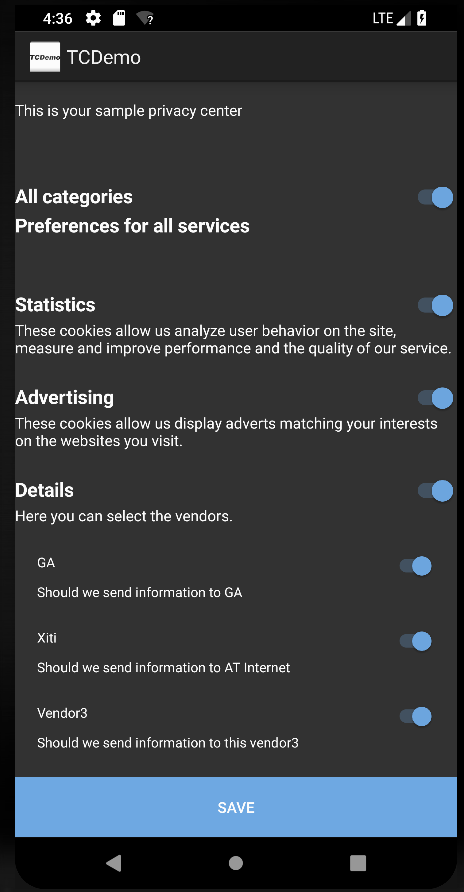
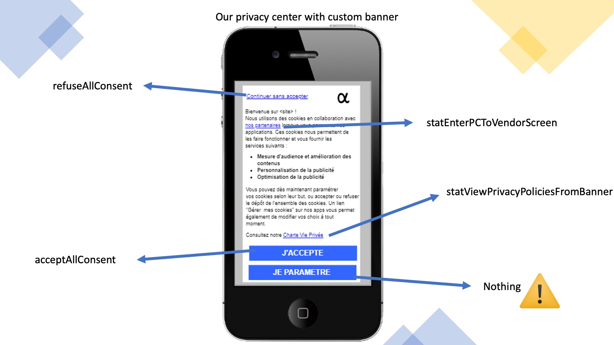
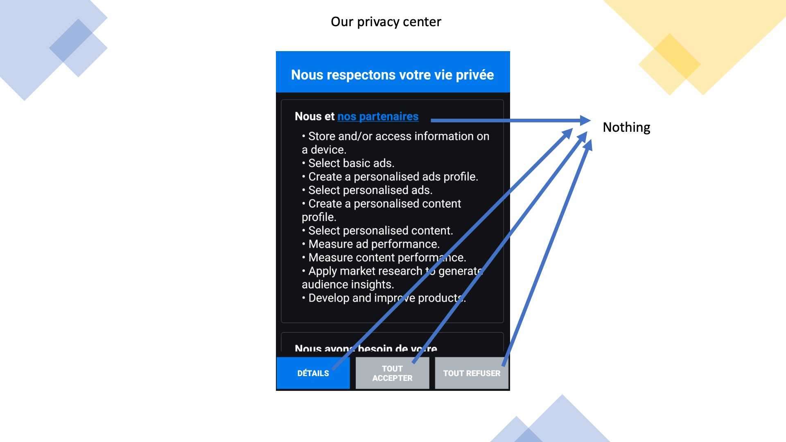
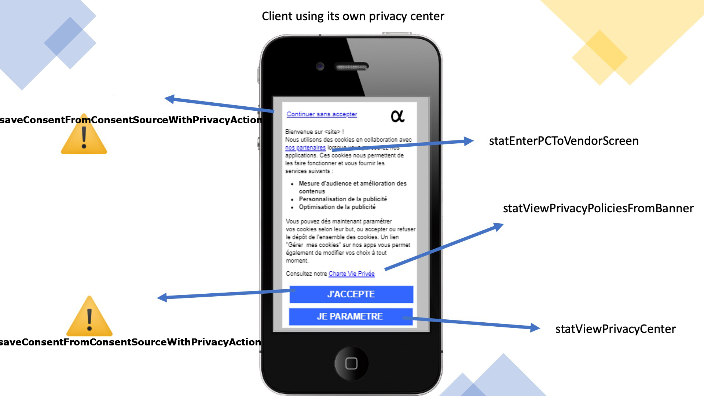
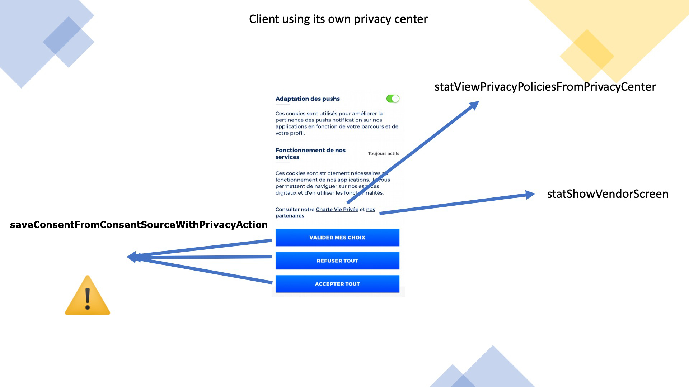

<html>
<body>

<h1 id="privacys-implementation-guide">Privacy's Implementation Guide</h1>

<strong>Android</strong>

Last update : <em>12/05/2021</em> 
Release version : <em>4.7.4</em>

<ul>
<li><a href="#privacys-implementation-guide">Privacy's Implementation Guide</a></li>
<li><a href="#introduction">Introduction</a><ul>
<li><a href="#choose-your-privacy">Choose your privacy</a></li>
<li><a href="#setup">Setup</a><ul>
<li><a href="#minimum-requirements">Minimum Requirements</a></li>
<li><a href="#with-the-sdk">With the SDK</a></li>
<li><a href="#standalone">Standalone</a></li>
</ul>
</li>
<li><a href="#saving-consent">Saving consent</a><ul>
<li><a href="#with-the-privacy-center">With the Privacy Center</a></li>
<li><a href="#manually-displayed-consent">Manually displayed consent</a></li>
<li><a href="#acceptall-refuseall">AcceptAll / RefuseAll</a></li>
</ul>
</li>
<li><a href="#retaining-consent">Retaining consent</a><ul>
<li><a href="#using-user-id">Using user ID</a></li>
<li><a href="#using-tc_normalized_id">Using TC_NORMALIZED_ID</a></li>
<li><a href="#using-tc_sdk_id">Using TC_SDK_ID</a></li>
</ul>
</li>
<li><a href="#displaying-consent">Displaying consent</a><ul>
<li><a href="#global-consent">Global consent</a></li>
</ul>
</li>
<li><a href="#reacting-to-consent">Reacting to consent</a></li>
<li><a href="#forwarding-consent-to-webviews">Forwarding consent to webViews</a></li>
<li><a href="#changing-consent-versiob">Changing consent versiob</a></li>
<li><a href="#consent-internal-api">Consent internal API</a></li>
<li><a href="#privacy-center">Privacy Center</a><ul>
<li><a href="#change-the-default-state-of-the-switch-button-to-disabled">Change the default state of the switch button to disabled:</a></li>
<li><a href="#deactivate-the-back-button-to-force-the-consent">Deactivate the back button to force the consent:</a></li>
</ul>
</li>
<li><a href="#privacy-statistics">Privacy statistics</a></li>
<li><a href="#tcdemo">TCDemo</a></li>
</ul>
</li>
<li><a href="#support-and-contacts">Support and contacts</a></li>
</ul>

<h1 id="introduction">Introduction</h1>

The privacy module can be used in a lot of different ways, after this short introduction, you will find links to each of the different ways and their specific documentations.

Having the user consent is essential to send sensible information like the IDFA/AAID or using any personal information to serve advertising.

We created this module to simplify the management of you user's privacy and the way to use it.

This module can:

<pre><code>- Display a consent page (if needed)
- Save consent inside the phone and reload it every time the application is launched.
- Check the validity of the consent. The validity duration is set to 13 months.
- Send a hit to our servers to record the consent. For statisical purposes.
- Save the consent String (if used alongside IAB)
- Enable or disable the SDK. (if used alongside the SDK)
- Add the categories automatically to the hits the SDK sends. (if used alongside the SDK)
- Forward the consent to the developpers if they need it outside of the module.
</code></pre>
<h2 id="choose-your-privacy">Choose your privacy</h2>

Privacy comes with two major flavors:

<pre><code>- With Tag Management (With SDK)
- Standalone
</code></pre>

And 3 different ways to display it:

<pre><code>- Manually and then forwarding us the information
- Using our Privacy Center for IAB version 2
- Using our Privacy Center for simple Privacy
</code></pre>

If you're unsure of which one you should use, please contact the person in charge of your account.

<a href="../TCIAB/README.md">To use IAB V2 please see here</a>

<h2 id="setup">Setup</h2>

/!\ If you are using our interface, you need to have a version of privacy.json inside your project. This will prevent any issues with users with bad or no internet at all. If you are using IAB please also take vendor-list.json and the translation file purposes-fr.json.
If you are not using our interface, you can't use our privacy.json, if you want a way to use a configuration file, please ask your dev team to manage this file.

After initialisation the Privacy module will check the consent validity. If the consent is too old a callback will be called. Please check the Callback part.
The default value is 13 months.

If you're using our interface, and thus our privacy.json, you can change the duration on this validity.
To do this, add "consentDurationInMonths": "6" inside the "information" bloc.

If you're not using our interface, you'll have to manually change it in the code.
We express this duration in months. The duration of a month is calculated by 365/12 days.
Please first call the following method before initializing the Privacy module else:

<pre><code>TCPrivacy.getInstance().setConsentDuration(6);
</code></pre>
<h3 id="minimum-requirements">Minimum Requirements</h3>

Privacy module requires a minimum SDK version of 17.

<h3 id="with-the-sdk">With the SDK</h3>

Modules: Core, Privacy, SDK

This module can use the same model you are using on the web, if you do so, please start by getting the IDs of the categories you are going to use.
Join those IDs with a "consent version". Default is 001, but if you change the implementation, it's better to increment this version.

The setup is really simple, pass to the TCPrivacy object your site ID, application context and a pointer to your TagCommanders' SDK instance. If you want to add your consent version, you can add it to the parameters as a String.

<pre><code>TCPrivacy.getInstance().setSiteIDPrivacyIDAppContextTCInstance(site_id, privacy_id, context, TC);
</code></pre>

If you're using you're own Privacy Center, use the following function instead:

<pre><code>TCPrivacy.getInstance().initWithCustomPCMAndTCInstance(site_id, privacy_id, context, TC);
</code></pre>

This call will check the saved consent, putting the SDK on hold if nothing is found, and start/stop the SDK if something is saved.

<h3 id="standalone">Standalone</h3>

Modules: Core, Privacy

You won't need the SDK module, and will need to implement a callback to manage your solutions when consent is given or re-loaded.

The setup is really simple, pass to the TCPrivacy object your site ID  application context. If you want to add your consent version, you can add it to the parameters as a String.

<pre><code>TCPrivacy.getInstance().setSiteIDPrivacyIDAppContext(site_id, privacy_id, appContext);
</code></pre>

If you're using you're own Privacy Center, use the following function instead:

<pre><code>TCPrivacy.getInstance().initWithCustomPCM(site_id, privacy_id, context);
</code></pre>
<h2 id="saving-consent">Saving consent</h2>

Here is where the IDs of the categories matters.

<h3 id="with-the-privacy-center">With the Privacy Center</h3>

If you're using the Privacy Center, nothing has to be done here, it will automatically propagate the consent to all other systems. And the ID will be the one used in the configuration file. Please check the Privacy Center part for more information.

Please keep your category IDs between 1 and 999.

<h3 id="manually-displayed-consent">Manually displayed consent</h3>

Once the user validated his consent, you can the send the information to the Privacy module as follow:

<pre><code>:::java
Map&lt;String, String&gt; consent = new HashMap&lt;&gt;();
consent.put("PRIVACY_CAT_1", "1");
consent.put("PRIVACY_CAT_2", "0");
consent.put("PRIVACY_CAT_3", "1");
consent.put("PRIVACY_VEN_61", "1");
TCPrivacy.getInstance().saveConsent(consent);
</code></pre>

Please prefix your category IDs with "PRIVACY_CAT_" and your vendor IDs with "PRIVACY_VEN_. 1 mean accepting this category or vendor, 0 is refusing.

If you're using the SDK, this will propagate the information to the SDK and manage its state.

<h3 id="acceptall-refuseall">AcceptAll / RefuseAll</h3>

/!\ Those methods only work if you are using our interface and thus have a privacy.json in your project (and maybe IAB's JSON as well).

Those are intended for clients that are displaying a first "popup" screen before our interfaces and that have a way to either open the privacy center of accept/refuse the consent.

We created functions to call if you want to create a simple way to accept or refuse all consent from outside our user interface.

<pre><code>TCPrivacy.getInstance().acceptAllConsent();
TCPrivacy.getInstance().refuseAllConsent();
</code></pre>
<h2 id="retaining-consent">Retaining consent</h2>

The saving of the consent on our servers is done automatically.

But since we are saving the consent in our servers, we need to identify the user one way or another. By default the variable used to identify the user consenting is #TC_SDK_ID#, but you can change it to anything you'd like.

If you want to use an ID already inside the SDK:

<pre><code>:::java
TCPrivacy.getInstance().setUserID(TCCoreConstants.kTCPredefinedVariable_NormalizedID);
</code></pre>

If you want to use an ID from your data layer, please first add it to the permanent store:

<pre><code>:::java
TC.addPermanentData("MY_ID", "12345");
TCPrivacy.getInstance().setUserID("MY_ID");
</code></pre>

and if you simply want to simply pass the information:

<pre><code>:::java
TCPrivacy.getInstance().setUserID("123456765432");
</code></pre>

This can be used to save the display of the consent, and giving the consent.

This ID is very important because it will be the basic information used to get back the consent when you need a proof.

<h3 id="using-user-id">Using user ID</h3>

You will be able to get the information more easily since this is an ID available by several means for you.

<h3 id="using-tc_normalized_id">Using TC_NORMALIZED_ID</h3>

You will get the IDFA/AAID most of the time (as long as the user is not opt-out) and a generated ID the rest of the time. This might allow you to get the information if you know the device identifier.
Otherwise, you will have to get the ID stored in the app memory. See TC_SDK_ID.

<h3 id="using-tc_sdk_id">Using TC_SDK_ID</h3>

In this case the only place where the ID exists is inside the application memory.
If you're looking for a way to proove consent or reset saved information, you'll need to create a specific screen in app for this.

<h2 id="displaying-consent">Displaying consent</h2>

If you are familiar with Commanders Act privacy for web, you know that we actually record two things. The first thing is "displaying the consent form".
This allow you to prove that a user has indeed been shown the consent screen even if he somehow left without accepting/refusing to give his consent.

In some cases, client also use this to infer user consent since he continued using the application after he was shown the consent screen.
We don't recommend this behaviour, please discuss it with your setup team first.

Either way it's interesting to be able to log the fact that the consent screen has been viewed. If you're not using the Privacy Center, please call:

<pre><code>TCPrivacy.getInstance().viewConsent();
</code></pre>
<h3 id="global-consent">Global consent</h3>

We integrated an On/Off switch so that the user can consent to all categories at the same time.
It's not mandatory yet, but recommended.

<h2 id="reacting-to-consent">Reacting to consent</h2>

Some of the event happening in the SDK have callbacks associated with them in the case you need to do specific actions at this specific moment.

Currently we have a callback function that lets you get back the categories and setup your other partners accordingly.
This is the function where you would tell your ad partner "the user don't wan't to receive personalized ads" for example.

/!\ Don't forget to register to the callbacks <em>before</em> the initialisation of the Privacy Module since the module will check consent at init and use the callback at this step.

<pre><code>void consentUpdated(Map&lt;String, String&gt; categories);
</code></pre>

Called when either:

<ul>
<li>We load the saved consent</li>
<li>consent is given inside the privacy center</li>
<li>you manually give us the user selected consents</li>
</ul>

We have a Map which is the same as the one given to our SDK with keys PRIVACY_CAT_n and PRIVACY_VEN_n and value "0" or "1".
In the case nothing was consented to, you might also have an empty map (but not null).

<pre><code>void consentOutdated();
</code></pre>

This is called after 13 months without change in the user consent. This can allow you to force displaying the consent the same way you would on first launch.

<pre><code>void consentCategoryChanged();
</code></pre>

When you make a change in the JSON, there is nothing special to do.
But when this change is adding or removing a category, or changing an ID, we should re-display the Privacy Center.

<pre><code>void significantChangesInPrivacy();
</code></pre>

This one is slightly different from the last one, it was created for IAB and will not be sent automatically. It is conditionned by the field "significantChanges" in the privacy.json so that it will only launch when you need it to.

Please also note that the events "starting the SDK" and "stopping the SDK" have a notification sent with them, you can listen to them if needed: TCCoreConstants.kTCNotification_StartingTheSDK and TCCoreConstants.kTCNotification_StoppingTheSDK.

<h2 id="forwarding-consent-to-webviews">Forwarding consent to webViews</h2>

Some clients need to have the consent forwarded in their webViews to manage a web container inside it.
We created a function to get the privacy as a JSON string so you can save it inside the webView's local storage.
/!\ This function only help saving it to the local storage by giving the required format, you will still need to have JS code in the web container to use it. Please ask your consultant for this part.

<pre><code>public String getConsentAsJson()
</code></pre>
<h2 id="changing-consent-versiob">Changing consent versiob</h2>

If the case you need to manually change the consent duration (if you're using your own privacy center for example), you can use the following:

<pre><code>TCPrivacy.getInstance().consentVersion = "132";
</code></pre>
<h2 id="consent-internal-api">Consent internal API</h2>

We created several methods to check given consent. They are simple, but make it easier to work with consent information at any given time.

<pre><code>/**
 * Checks if we should display privacy center for any reason.
 * @param appContext the application context.
 * @return True or False.
 */
public static boolean shouldDisplayPrivacyCenter(Context context)
</code></pre>

&nbsp;

<pre><code>/**
 * Checks if consent has already been given by checking if consent information is saved.
 * @param appContext the application context.
 * @return true if the consent was already given, false otherwise.
 */
public static boolean isConsentAlreadyGiven(Context appContext);
</code></pre>

&nbsp;

<pre><code>/**
 * Return the epochformatted timestamp of the last time the consent was saved.
 * @param appContext the application context.
 * @return epochformatted timestamp or 0.
 */
public static Long getLastTimeConsentWasSaved(Context appContext);
</code></pre>

&nbsp;

<pre><code>/**
 * Check if a Category has been accepted.
 * @param ID the category ID.
 * @param appContext the application context.
 * @return true or false.
 */
public static boolean isCategoryAccepted(int ID, Context appContext);
</code></pre>

&nbsp;

<pre><code>/**
 * Check if a vendor has been accepted.
 * @param ID the vendor ID.
 * @param appContext the application context.
 * @return true or false.
 */
public static boolean isVendorAccepted(int ID, Context appContext);
</code></pre>

&nbsp;

<pre><code>/**
 * Get the list of all accepted categories.
 * @param appContext the application context.
 * @return a List of PRIVACY_CAT_IDs.
 */
public static List&lt;String&gt; getAcceptedCategories(Context appContext);
</code></pre>

&nbsp;

<pre><code>/**
 * Get the list of all accepted vendors.
 * @param appContext the application context.
 * @return a List of PRIVACY_VEN_IDs.
 */
public static List&lt;String&gt; getAcceptedVendors(Context appContext);
</code></pre>

&nbsp;

<pre><code>/**
 * Get the list of everything that was accepted.
 * @param appContext the application context.
 * @return a List of PRIVACY_VEN_IDs and PRIVACY_CAT_IDs.
 */
public static List&lt;String&gt; getAllAcceptedConsent(Context appContext);
</code></pre>

&nbsp;

<pre><code>/**
 * Check if a purpose has been accepted.
 * @param ID the purpose ID.
 * @param appContext the application context.
 * @return true or false.
 */
public static boolean isIABPurposeAccepted(int ID, Context appContext);
</code></pre>

&nbsp;

<pre><code>/**
 * Check if a vendor has been accepted.
 * @param ID the vendor ID.
 * @param appContext the application context.
 * @return true or false.
 */
public static boolean isIABVendorAccepted(int ID, Context appContext);
</code></pre>

&nbsp;

<pre><code>/**
 * Check if a special feature has been accepted.
 * @param ID the vendor ID.
 * @param appContext the application context.
 * @return true or false.
 */
public static boolean isIABSpecialFeatureAccepted(int ID, Context appContext);
</code></pre>

&nbsp;

<h2 id="privacy-center">Privacy Center</h2>

The Privacy Center is represented by a JSON file that describes the interfaces that will be created by native code inside the application.

In the Android SDK we create an Activity which is an easy way to display a "page" without have to create a specific fragment space for it.
Offline JSON has to be saved in the src/main/assets folder.

To start the Privacy Center, you have to launch the corresponding activity.

<pre><code>Intent PCM = new Intent(getContext(), com.tagcommander.lib.privacy.TCPrivacyCenter.class);
startActivity(PCM);
</code></pre>

Some part of the Privacy Center can be customised with your code.

<h3 id="change-the-default-state-of-the-switch-button-to-disabled">Change the default state of the switch button to disabled:</h3>
<pre><code>TCPrivacy.getInstance().switchDefaultState = false;
</code></pre>
<h3 id="deactivate-the-back-button-to-force-the-consent">Deactivate the back button to force the consent:</h3>

Going back without consenting will result in a user not consenting at all. This means that no privacy will be saved, no tag can be called and no consent-string will be created if you use IAB.

<pre><code>TCPrivacy.getInstance().deactivateBackButton = true;
</code></pre>

For now this JSON has to be created and managed manually. But soon, this will be created by our interfaces. And the SDK will check for updates of the file automatically.
Meanwhile the configuration has to be done manually and you can find the definition of the file here.

<pre><code>:::json
{
    "information": {
        "update": "2018-10-23",
        "version": "1",
        "content": "\nThis is your sample privacy center.",
        "saveButton": "Save",
        "privacy_policy_url": "https://www.commandersact.com/en/privacy/",
        "privacy_policy_text": "Privacy policy"
    },
    "customisation": {
        "content": {
            "fontcolor": "#ffffff",
            "backgroundcolor": "#333333"
        },
        "button": {
            "fontcolor": "#ffffff",
            "backgroundcolor": "#6faae5"
        }
    },
    "global_consent" : {
        "name" : "All categories", "ID": "0", "description" : "Preferences for all services\n\n"
    },
    "categories": [
        { "name" : "Statistics", "ID" : "1234", "description" : "These cookies allow us analyze user behavior on the site, measure and improve performance and the quality of our service." },
        { "name" : "Advertising", "ID" : "1444", "description" : "These cookies allow us display adverts matching your interests on the websites you visit.", "privacy_policy_url": "https://www.commandersact.com/en/privacy/1", "privacy_policy_text": "Privacy policy" },
        { "name" : "Details", "ID" : "4", "description" : "Here you can select the vendors.", "subcategories": [
            { "name" : "GA", "ID" : "5", "description" : "Should we send information to GA.", "privacy_policy_url": "https://www.google.com/analytics/terms/us.html", "privacy_policy_text": "Privacy policy" },
            { "name" : "Xiti", "ID" : "6", "description" : "Should we send information to AT Internet." },
            { "name" : "Vendor3", "ID" : "7", "description" : "Should we send information to this vendor3." }
        ]}
    ]
}
</code></pre>

The <em>information</em> part contain information about the date of the configuration, the version of the file (not of the consent), the global text introducing the Privacy and the name of the save/back button.

The <em>customisation</em> part defines colors for the content and the buttons, if not present, no style will be applied to your buttons.

The <em>global_consent</em> let you customize the text alongside the global consent button. If not present, no global consent button will appear inside your app.

The <em>categories</em> let you give all the categories to accept or refuse and define their names, IDs and description. If a category has sub categories, you can define them in <em>subcategories</em>.

If you want to display a link to you privacy policies (or anything else in fact), you can add together "privacy_policy_url" and "privacy_policy_text" that will form a linkable text the line after the description.

Example:

<h2 id="privacy-statistics">Privacy statistics</h2>

We have dashboards that allow to have detailed statistics on the choices your users are making.
Depending on your app privacy configuration you might have to call some additional functions.

<pre><code>- Custom « banner/popup » -&gt; our privacy center
- Custom « banner/popup » -&gt; Custom privacy center
- Directly to our privacy center
- Custom privacy center
</code></pre>

Whenever saveConsent* is called you will need to provide the list of purposes and vendors that have been consented to.

Also please note that you will need to call statViewBanner when you display your custom banner.

<h2 id="tcdemo">TCDemo</h2>

You can, of course, check our demo project for a simple implementation example.

<a href="https://github.com/TagCommander/Privacy-Demo/tree/master/Android">Privacy Demo</a>

<h1 id="support-and-contacts">Support and contacts</h1>

<strong>Support</strong>
<em>support@commandersact.com</em>

http://www.commandersact.com

Commanders Act | 3/5 rue Saint Georges - 75009 PARIS - France

This documentation was generated on 12/05/2021 15:28:59

</body>
</html>